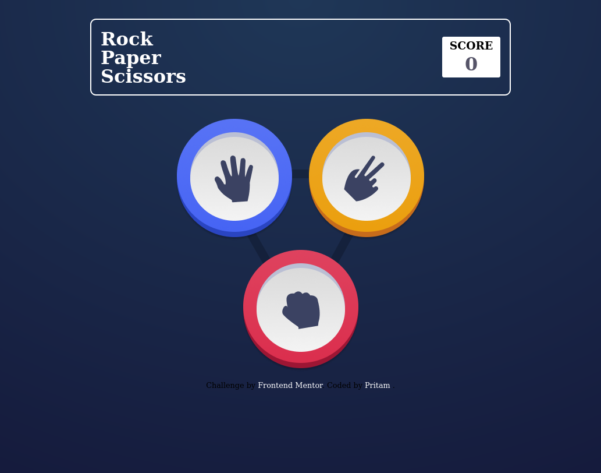
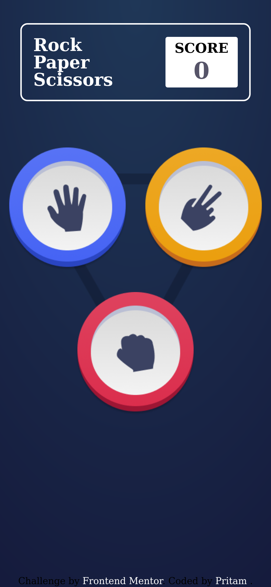

# Rock, Paper, Scissors solution
Rock Paper Scisssors game form Frontend Mentor's Challenge


## Table of contents

- [Overview](#overview)
  - [Screenshot](#screenshot)
  - [Links](#links)
  - [Built with](#built-with)
  - [What I learned](#what-i-learned)
 
## Overview
This is Rock Paper Scissors Game Built With HTML SCSS JavaScript from the forntend mentors website built for  JavaScript Practice Purpose & Fun !

### Screenshots





### Links

- Live Site URL: [Play Here](https://play-rps-game.netlify.app/)


### Built with

- Semantic HTML5 markup
- CSS custom properties
- Flexbox
- CSS Grid
- Mobile-first workflow

### What I learned

Use this section to recap over some of your major learnings while working through this project. Writing these out and providing code samples of areas you want to highlight is a great way to reinforce your own knowledge.

To see how you can add code snippets, see below:

```html
<h1>Some HTML code I'm proud of</h1>
```
```css
.proud-of-this-css {
  color: papayawhip;
}
```
```js
const proudOfThisFunc = () => {
  console.log('🎉')
}
```

### Useful resources
youtube.com/cleaverprogrammer

## Author

- GitHub - [Pritam Bera](https://github.com/pritambera2000)
- Twitter - [@dotslashpritam](https://www.twitter.com/dotslashpritam)

